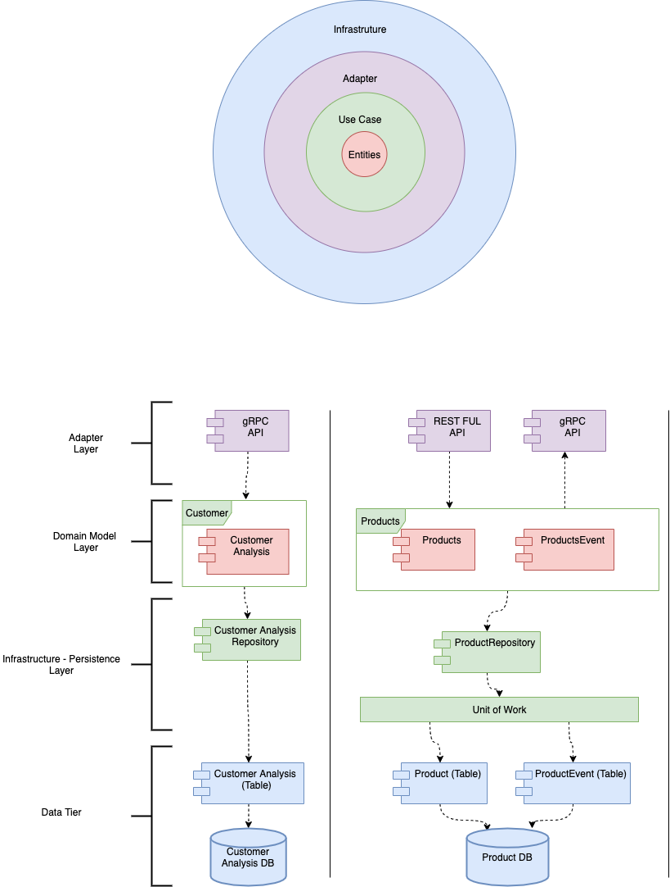
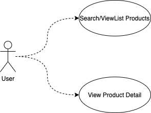
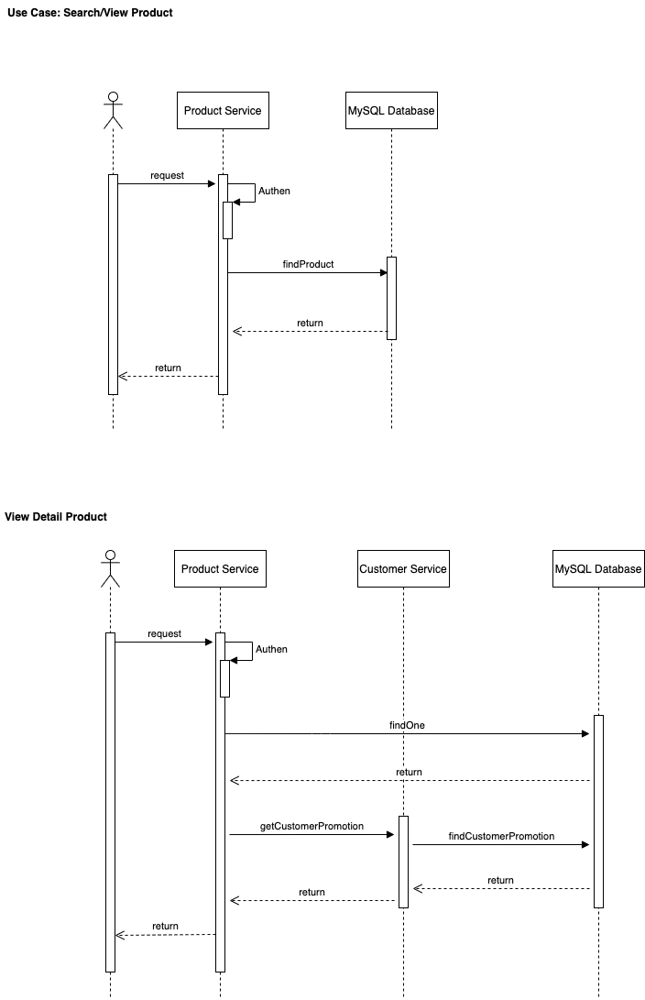
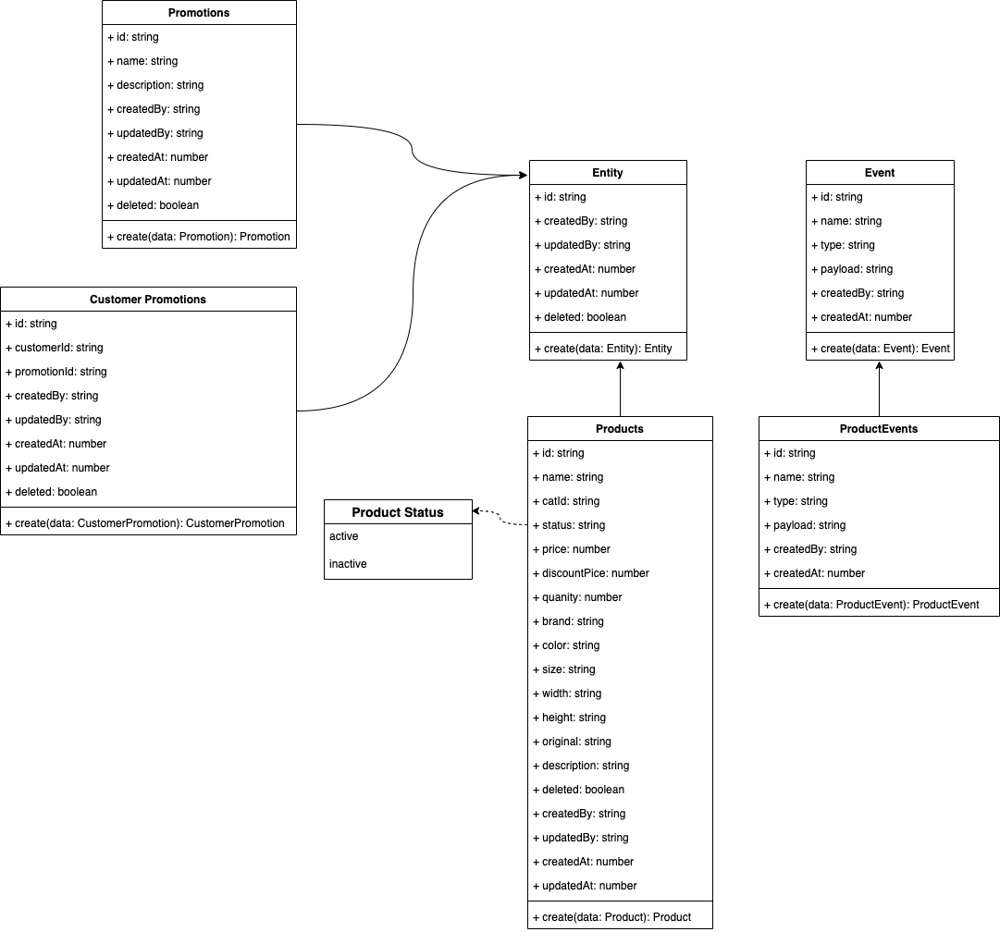
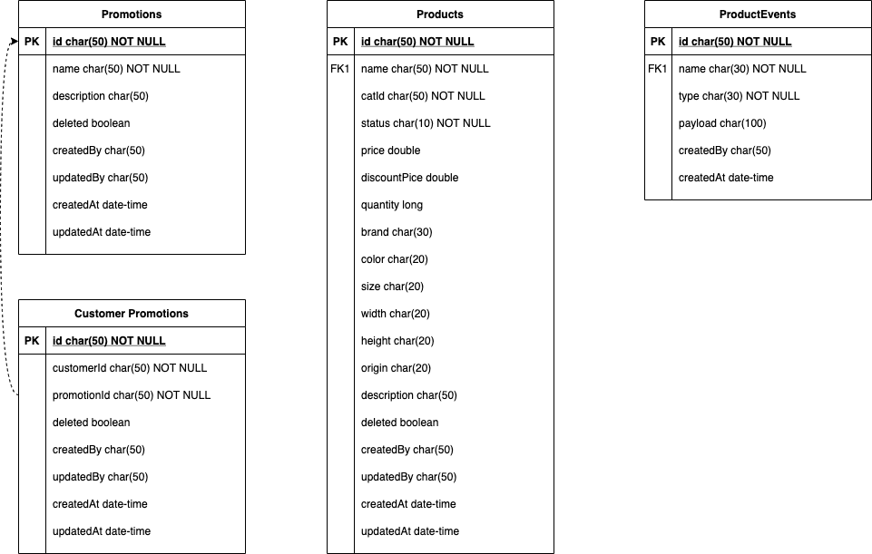

# NAB NestJs Micro-Services Architecture

This is Architecture of NAB Services

## Architecture

Here is the Overview Software Architecture of NAB Services.

## Use Case

Use case for NAB Services:
- Search/ViewList **Products**: **Users** View List and Searching the **Products**.
- View Deatil **Product**: **Users** view detail **Product** as **Customers** or **Anomyous User**. With **Customer** position, user can received some **Promotions**, that analyzed by **Customer Analysis System**.

## Sequence Diagram

The Sequence Diagram for two Services:
- Search/ViewList **Products**: The request will send to **Product Service**. In here,
the service will authenticate/authorize the user and then call a request to **MySQL DB**. After received the data from the **DB**, the **Product Service** will response the result to User. 
- View Deatil **Product**: The request will send to **Product Service**. In here,
the service will authenticate/authorize the user and then call a request to **MySQL DB**. After received the data from the **DB**, the **Product Service** will call a request to **Customer Analysis Service** to get **Promotions** data corresponding to user. In the end, the **Product Service** will response the result to User. 

## Models

Models Defination:
- **Entity** and **Event** are two base model.
- **Entity** is base model that take care about the core domain model.
- **Event** is base model that take care about the logging user action.
- Frequently, all entities will extends **Entity** and have a event model extends from **Event**. Clearly that, in **Product Service**, the **Products** model will extends the **Entity** model and also has a **ProductEvents** model, that extends from **Event** model.
- In the **Customer Analysis** service, customer's promotions (**Customer Promotion**) is one kind of the base data and will also extends from **Entities Model** but not have the events data.

## Entities Relationship

Entities: Products, ProductEvent, Promotion, Customer Promotion.
